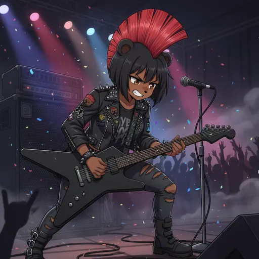

# AI & Creative

  
  
  
  

Part of the [Bobina Council Docs](../../README.md).

- [AI Companion](./ai-companion.md)
- [Bobina Terminal](./bobina-terminal.md)
- [Token Tracking](./token-tracking.md)
- [Bobina LoRA](./bobina-lora.md)

