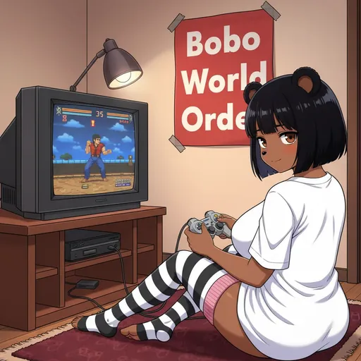

# Council Governance

  
  
  

Shape the future of the platform through community-driven governance proposals.

### Dual Proposal System

The Bobina Council features two distinct proposal systems:

- 🎨 **Bobina Proposals:** Community-driven submissions of new Bobina art that are voted on before being added to the main gallery. Submit via the [Contribute](https://bobina.moe/contribute) page and view active proposals on the [Proposals](https://bobina.moe/proposals) page.
- ⚖️ **Council Proposals:** Platform governance proposals for features, improvements, bug reports, and community decisions that shape the future of the ecosystem. View active proposals on the [Council Proposals](https://bobina.moe/council-proposals) page.

The Council Governance system allows members to propose and vote on platform changes, features, bug reports, and community decisions. This is separate from Bobina art proposals and focuses on the evolution of the platform itself.

### Proposal Categories

- 🚀 **Feature Request:** Propose new features or functionality for the platform.
- 🐞 **Bug Report:** Report issues or bugs that need to be addressed.
- ⚖️ **Council Decision:** Propose governance decisions or policy changes.
- 💡 **Platform Improvement:** Suggest improvements to existing features.
- 👥 **Community Suggestion:** General suggestions from the community.

### Voting Mechanics

Both Bobina Proposals and Council Proposals use the same voting system:

- Proposal Voting New submissions appear on their respective proposals pages. Only logged-in users can vote on them until they reach an approval or rejection threshold.
- Gallery Voting & Fire Multipliers (🔥) Once a Bobina is approved and added to the main gallery, the real competition begins. A Bobina in the gallery earns its first flame (🔥) at 5 votes. For every additional 5 votes, the multiplier increases (e.g., 🔥x2 at 10 votes). Fire multipliers only apply to Bobinas in the gallery, not proposals.
- 💋 Hot Bobina Alerts When a Bobina in the main gallery achieves a new rank by reaching a vote milestone (e.g., 10 votes for Common, 25 for Uncommon), a "Hot Bobina Alert" is automatically posted in our Telegram to celebrate the achievement and announce the new rank. These alerts only trigger for Bobinas in the gallery, not proposals.

### Approval Threshold

All proposals (both Bobina and Council) are approved when they reach a score of **+10 votes**. Bobina proposals are automatically added to the main gallery, while Council proposals are archived in the [Council Records](https://bobina.moe/council/records).

### Rejection Threshold

All proposals are rejected when they reach a score of **-10 votes** and are permanently removed.

> **Info:** For step-by-step submission instructions, see the [How to Contribute](https://bobina.moe/docs#contribute) section.

---

  

Art from the <a href="https://bobina.moe/bobinas">Bobina gallery</a> · Back to the <a href="../../README.md">Docs index</a>

