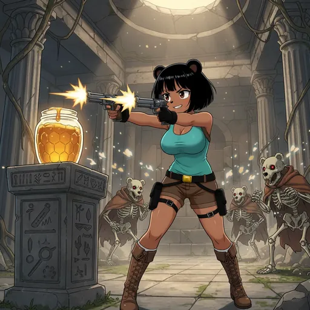
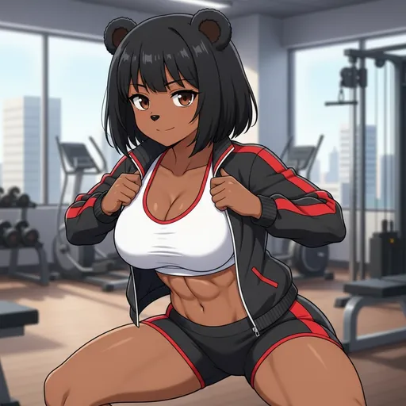

# How to Contribute

  
  
  

Submit your own Bobina art or propose platform changes via the official [Contribute Page](https://bobina.moe/contribute).

The Contribute page allows you to choose between two types of contributions: submitting Bobina art or proposing platform changes through the Council Governance system.

### Bobina Art Submission

1. Navigate to the [Contribute](https://bobina.moe/contribute) page and select "Submit Bobina Art".
2. Log in with your account if you haven't already.
3. Upload your image or GIF.
4. Fill in a witty caption for your Bobina.
5. Add a longer description of your Bobina and some comma-separated tags.
6. Hit "Submit for Approval".

### Council Proposal Submission

1. Navigate to the [Contribute](https://bobina.moe/contribute) page and select "Council Proposal".
2. Choose a category (Feature Request, Bug Report, Council Decision, etc.).
3. Write a clear title and detailed description of your proposal.
4. Submit for community voting.

### Image prompt enhancer

On the Contribute page, the image prompt enhancer tries to improve your prompt before generation. It is **free** and does **not** retry.

If it cannot produce a better prompt, it shows:

> Couldn't enhance this prompt right now (you weren't charged). Your prompt is unchanged.

Your original prompt is left as you wrote it. A failed enhance is not treated as a successful rewrite.

### Image Requirements (Bobina Art Only)

- **Aspect Ratio:** Strictly 1:1 (a perfect square). e.g., 1200x1200 pixels.
- **File Size:** Maximum of 4MB.
- **Accepted Formats:** JPG, PNG, WEBP, and GIF.

For inspiration and our official AI prompt tutorial, please visit the [Branding Page](https://bobina.moe/branding).

### What Happens Next?

**For Bobina Art:** Your submission will appear on the [Proposals](https://bobina.moe/proposals) page. The community will vote on it, and if it reaches the approval threshold, it will automatically be added to the main gallery! A notification will also be sent to our Telegram channel.

**For Council Proposals:** Your proposal will appear on the [Council Proposals](https://bobina.moe/council-proposals) page for community voting. Approved proposals are archived in the [Council Records](https://bobina.moe/council/records) and reviewed by the development team for implementation.

---

  

Art from the <a href="https://bobina.moe/bobinas">Bobina gallery</a> · Back to the <a href="../../README.md">Docs index</a>

