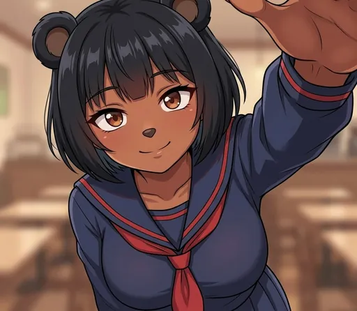
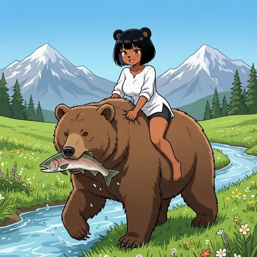
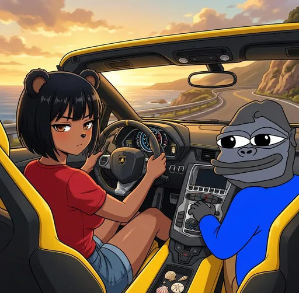

# Legacy Bobinas

  
  
  

A special status for our earliest supporters.

A "Legacy Bobina" is a special designation for any Bobina that was submitted and approved by the Council during the official presale stage of our launch. These entries form the foundation of our gallery and represent the contributions of our very first community members.

All Legacy Bobinas are marked with the `#legacy` tag, making them easy to find.

After the presale concludes, no new Legacy Bobinas will ever be created. This status is exclusive to those who participated in our launch. You can check the presale status and end time on the [presale page](https://bobina.moe/presale).

---

  

Art from the <a href="https://bobina.moe/bobinas">Bobina gallery</a> · Back to the <a href="../../README.md">Docs index</a>

