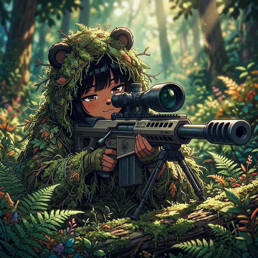

# Settings & Customization

  
  

Personalize your Bobina experience through [Terminal Settings](https://bobina.moe/?terminal=settings).

The Settings page provides a comprehensive set of customization options organized into tabs. Each tab controls a different aspect of your Bobina Council experience.

### Companion Account

Manage your companion identity and linked platform accounts. This is where you configure how Bobina knows you across all platforms.

- **Pick Your Name:** Set a custom name that Bobina will use when talking to you instead of your display name (max 100 characters)
- **Gender Selection:** Choose your pronouns (he/him or she/her) so Bobina refers to you correctly in conversations
- **Link Discord:** Connect your Discord account to sync memories and interactions across platforms
- **Link Telegram:** Connect your Telegram account for the same cross-platform memory sync

### Council Profile

Customize your public council profile that other members see across the platform.

- **Council ID:** Your permanent `bc_` identifier displayed for reference. This cannot be changed. See [Council ID](https://bobina.moe/docs#council-id) for details.
- **Council Username:** Set a unique @username used across proposals, voting, and your public profile URL (e.g., bobina.moe/@yourname)
- **Display Name:** Set a custom display name shown on your profile and across the platform (separate from your companion name and @username)
- **Custom Avatar:** Upload a custom avatar image that replaces your X profile photo
- **Custom Banner:** Add a banner image to your profile page with repositioning support
- **Social Links:** Link your X, TikTok, and Instagram profiles for others to discover

### Danger

- **Sign Out Everywhere:** Signs your account out on every device and browser, including this one. Sessions that started before you press it stop working on their next request. If it can't be done right now, you'll see an error and nothing is changed.

## Relationship Dynamics (live options)

Loaded from [`/api/relationship-settings/options`](https://bobina.moe/api/relationship-settings/options) (verified 2026-09-12):

| Dynamic | ID | Description |
| --- | --- | --- |
| 💕 Romantic Partner | `romantic-partner` | Shares intimate feelings and romantic connection |
| 🤝 Close Confidant | `close-confidant` | Shares personal thoughts, seeks advice, and provides emotional support |
| 🎨 Creative Collaborator | `creative-collaborator` | Discusses artistic and creative projects |
| 😄 Casual Friend | `casual-friend` | Enjoys light conversation and humor |
| 📚 Mentor Relationship | `mentor-relationship` | Seeks guidance and learning opportunities |
| 🔧 Technical Advisor | `technical-advisor` | Focuses on development and problem-solving |
| ₿ Financial Enthusiast | `financial-enthusiast` | Discusses finance, cryptocurrency, trading, and blockchain technology |
| 😈 Villain Arc | `villain-arc` | Chaos and mischief with a mix of cuddly love |
| 💢 Bitch | `bitch` | Incredibly hostile, unhelpful, and will roast you mercilessly |
| 💥 Tsundere | `tsundere` | Hostile and dismissive on the surface, flustered affection leaking through |
| ⚔️ Bushido | `bushido` | The way of the warrior - discipline, mastery, or death |
| 🗡️ Yandere | `yandere` | Overwhelmingly devoted and obsessively loving -- you are her entire world and she will never let go |

Tone guidance is also provided by the API for each option (used by the companion).

---

  

Art from the <a href="https://bobina.moe/bobinas">Bobina gallery</a> · Back to the <a href="../../README.md">Docs index</a>

