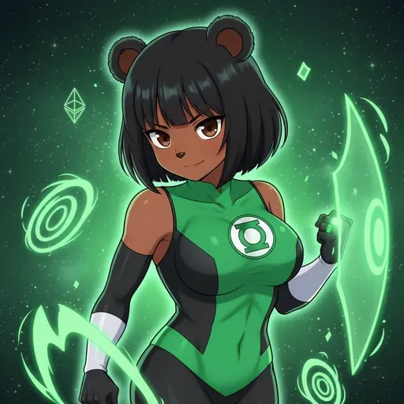

# Token Purchase

  
  

Buy $BOBINA tokens easily with our integrated Coinbase Onramp.

We've integrated Coinbase's onramp solution to make purchasing $BOBINA tokens as simple as possible. No need to navigate complex DEXs or manage multiple wallets - buy directly with your credit card or bank transfer.

### How to Buy

1. Visit the [Buy Page](https://bobina.moe/coinbase) or click "Buy $BOBINA" in the navigation.
2. Connect your wallet or create a new one through Coinbase.
3. Choose your payment method (credit card, debit card, or bank transfer).
4. Enter the amount of $BOBINA you want to purchase.
5. Complete the purchase - tokens are sent directly to your wallet!

### Benefits

- **Beginner-Friendly:** No need to understand DEXs, gas fees, or complex wallet setups.
- **Secure:** Powered by Coinbase's trusted infrastructure and security.
- **Fast:** Tokens arrive in your wallet within minutes of purchase.
- **Multiple Payment Options:** Credit card, debit card, or bank transfer supported.
- **Integrated Experience:** Buy tokens without leaving the Bobina Council website.

> **Info:** 💡 **Pro Tip:** You can also buy $BOBINA on decentralized exchanges like Uniswap if you prefer to use your existing wallet and ETH. Visit the [Buy page](https://bobina.moe/buy) for all purchase options.

---

  

Art from the <a href="https://bobina.moe/bobinas">Bobina gallery</a> · Back to the <a href="../../README.md">Docs index</a>

