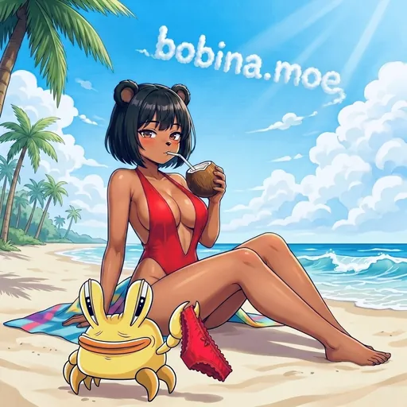

# Council ID (Bobina ID)

  
  
  

Your permanent, platform-independent identity in the Bobina Council.

## 🪪 What is a Council ID?

Every member who signs in to the Bobina Council is assigned a permanent Council ID (also called a Bobina ID). This is a unique identifier in the format `bc_xxxxxxxxxxxx` that stays with you forever, regardless of which platform you sign in with or how many times you change your username.

## ✨ Why Council IDs Matter

* **Platform Independence:** Your votes, proposals, companion data, and profile are all tied to your Council ID, not to your X, Google, TikTok, Discord, Telegram, or wallet account. If you change providers, your data follows you.
* **Username Freedom:** You can change your @username without losing any history. Your Council ID stays the same.
* **Cross-Platform Sync:** Your companion account on Discord and Telegram links back to your Council ID, keeping all your interactions, memories, and relationship data unified.
* **Wallet Verification:** When you verify your wallet, it is stored on your companion account and tied to your Council ID for credits, holder tier benefits, and token-gated features.

## 🔀 Council ID vs Platform ID

When you sign in via X, Google, TikTok, Discord, Telegram, or wallet, your provider returns a platform-specific identifier (e.g., `twitter:1386374574237966337`). This is your **Platform ID**.

| Property | Platform ID | Council ID |
| --- | --- | --- |
| Format | `provider:123456` | `bc_xxxxxxxxxxxx` |
| Purpose | Authentication only | Public identity for all data |
| Visible to users | No (internal) | Yes (Settings, admin tools) |
| Used for | OAuth login resolution | Votes, proposals, Bobinas, records, companion data |
| Changes if you switch providers | Yes (new provider = new Platform ID) | No (permanent) |

Your Platform ID is stored privately in `platform_to_bobina` and `loginProviders` so the system can map an OAuth sign-in to your Council account. It is never displayed on the site or used for attribution.

## 🔒 Soulbound Identity

> Your Council ID is **soulbound** — a term borrowed from gaming and Web3 that means it cannot be transferred, traded, or changed.

When you first sign in via any provider (X, Google, TikTok, Discord, Telegram, or wallet), that provider becomes your **Soulbound Provider**, marked with a **SOULBOUND** badge in your Social Profiles settings.

### Why Soulbound?

* Prevents account impersonation and identity theft
* Ensures your original sign-in method can always be used for account recovery
* Links your Council ID permanently to your first authentication, creating a verifiable identity chain
* Cannot be unlinked or removed, even if you add other OAuth providers later

You can link additional providers (X, TikTok, Discord, Telegram, Google, or wallets) to your account for convenience, but only your Soulbound Provider has permanent account recovery privileges and cannot be removed.

## 🔎 Finding Your Council ID

Your Council ID is displayed in **Terminal → Settings** (Profile tab) on [bobina.moe](https://bobina.moe/?terminal=settings).

It is a read-only value that cannot be changed. Share it with admins if you need account support.

> Source: official docs Council ID (synced 2026-09-12).

---

  

Art from the <a href="https://bobina.moe/bobinas">Bobina gallery</a> · Back to the <a href="../../README.md">Docs index</a>

