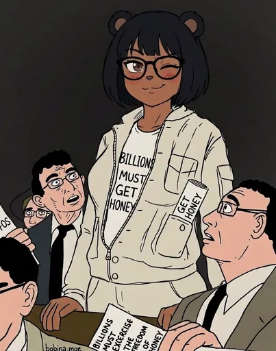
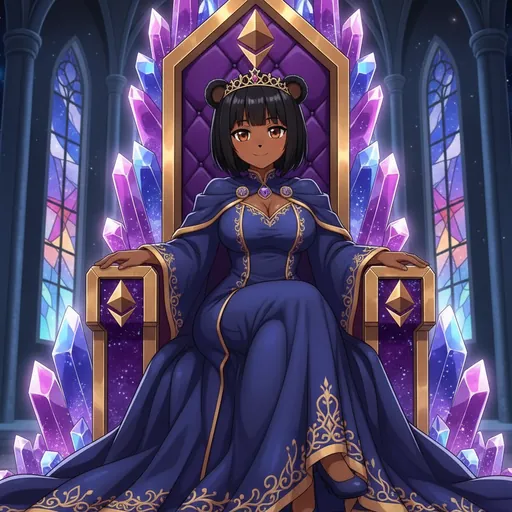

# Introduction

  
  
  

Welcome to the Bobina Council. Here's what you need to know.

This page aligns with the official docs **Introduction** on [bobina.moe/docs](https://bobina.moe/docs). For the live platform, visit [bobina.moe](https://bobina.moe).

## ❔ What are Bobinas?

Bobinas are unique digital collectibles, each with its own distinct personality and story. Bobinas are at the heart of the Bobina Council ecosystem on Ethereum, representing a blend of art, community, and love.

Browse the gallery at [bobina.moe/bobinas](https://bobina.moe/bobinas) to discover community-submitted Bobinas and vote on the ones you love.

## 👑 The Bobina Council

The Bobina Council is a decentralized autonomous organization (DAO) that governs the Bobina Council ecosystem. Signing in with a supported provider (X, Google, TikTok, Discord, Telegram, or wallet) is required to become a Council Member and participate in governance.

Once signed in, your permanent identity is a **Council ID** (also called a Bobina ID). Learn more in the [Council ID](./council-id.md) guide.

## 📜 Terms of Service and the 18+ check

The first time you visit, bobina.moe asks you to accept the Terms of Service and shows an 18+ age banner.

* The Terms dialog always appears on top. Accept it first, then complete the 18+ banner.
* This works the same on phones (iPhone, Android, and small screens) and inside in-app browsers like Telegram, Discord, and X. You can always reach and tap "I agree".
* If the site can't tell whether you've already accepted the Terms, it shows the dialog again rather than skipping it.
* Actions that need accepted Terms are refused with a `terms_required` response until you accept.
* The OAuth consent screen on bobina.moe, used when you link the Bobina Companion, also requires accepted Terms. See [Login with Bobina.moe](../reference/login-with-bobina.md).

### Where to go next

* **Official docs:** [https://bobina.moe/docs](https://bobina.moe/docs) — platform guides synced from the Council site
* **Live site:** [https://bobina.moe](https://bobina.moe) — gallery, proposals, companion, and more
* **This repository:** deeper guides for Council members and contributors

> Source: official docs Introduction (synced 2026-09-12).

---

  

Art from the <a href="https://bobina.moe/bobinas">Bobina gallery</a> · Back to the <a href="../../README.md">Docs index</a>

