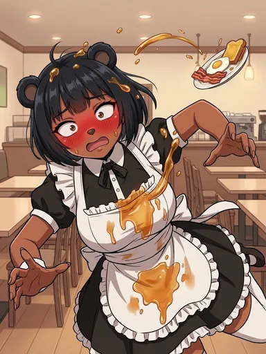
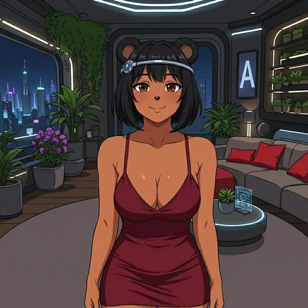

# Credits System

  
  
  

Power your interactions with Bobina using the credits economy.

> **Live values** from [`/api/credits/public-config`](https://bobina.moe/api/credits/public-config) (verified 2026-10-08). The docs page on bobina.moe loads this same endpoint.

## What Are Credits?

Credits are the currency that powers premium features in the Bobina Council ecosystem. Credits are required for conversations with Bobina and premium features like AI market opinions, charts, heatmaps, and Bobina generation.

## Credit Costs

| Action | Label | Cost |
| --- | --- | --- |
| `aiOpinion` | AI Market Opinion (/opinion) | 3 credits |
| `chartLookup` | Chart Lookup (/chart) | 1 credit |
| `heatmapGeneration` | Heatmap Generation (/heatmap) | 2 credits |
| `bobina.talk.text` | Talk to Bobina — Text reply | 1 credit |
| `bobina.talk.voice` | Talk to Bobina — Voice reply | 3 credits |
| `interjection` | Interjections | X credits each (configured price) |
| `bobinaGeneration` | Bobina Generation (Contribute) | 3 credits |

Zero-cost actions display as **Free**.

### Interjections

**Interjections · X credits each.** Her quick acknowledgement when you prompt her, plus anything you send while she's working (up to N per turn). Free daily slots first, refunded on failure.

X is the configured `interjection` price and N is `maxInterjectionsPerTurn`, both from the admin Credits Config (the live values are on [bobina.moe/credits](https://bobina.moe/credits)). The acknowledgement is part of this one entry, not a separate cost. When the first acknowledgement is on promotion the entry adds *First one free (promo)*; when both acknowledgements and mid-turn interjections are switched off it adds *Currently off*. **Switches (admin Credits Config):**

- **Acknowledgements (`acknowledgmentsEnabled`)**: on by default. When it's off, Bobina sends no turn-start acknowledgement on web, Telegram or Discord: the plain "Thinking..." placeholder stays until her reply, nothing is charged for an acknowledgement, and Grok Bot's wake carries no `bobina_opening` line. Mid-turn interjections are not affected.
- **Mid-turn interjections (`interjectionsEnabled`)**: on by default. When it's off (or the cap is 0), anything you send while she's working is refused in her voice (`interjections_disabled`) and never charged.
- If the config can't be read, nothing defaults to on: the acknowledgement is skipped and mid-turn messages are refused with `billing_unresolved`.

This wording comes from one description in the credits config, so the same text appears here, on bobina.moe, in the Companion `/credits` card and text, and in the MCP tool description.

## Earning Credits

Participate in the Bobina Council ecosystem to earn credits through community contributions. Earnings are capped at **5 credits per day**.

| Action | Label | Reward |
| --- | --- | --- |
| `vote` | Vote (Bobinas, Proposals, Articles) | +1 credit |
| `feedback` | Give Companion Feedback | +1 credit |
| `contribution` | Create a Bobina Proposal | +5 credits |
| `proposal` | Create a Council Proposal | +5 credits |

## Purchasing Credits

Buy credits to keep chatting with Bobina. Credits are priced at **$0.20 per credit**, with bulk presets:

| Package | Bonus |
| --- | --- |
| 50 credits | 0% bonus |
| 150 credits | 10% bonus |
| 500 credits | 20% bonus |

* Pay with **$BOBINA** tokens or **fiat via Stripe**
* Instant credit delivery after payment confirmation
* Credits expire **1 year after purchase**
* Credit purchases are announced in Telegram and Discord. Those announcements say: "Bobina Council LLC may use all proceeds at its sole discretion, with no commitment to buy back tokens."

Non-holders get `config.dailyFreeLimit` free messages per day, currently **0** (live). There is no code default: if the free-message setting is missing or invalid, credits fail closed with `billing_unresolved` instead of falling back to a number. When you run out, Bobina says "You've hit your daily limit, honey. Grab credits to keep going, or come back tomorrow!" with buttons to buy credits (in Telegram and Discord the plain-text reply says "Grab credits at bobina.moe/credits to keep going" instead), and the credits page shows your real free-messages-left count. Bobina generation includes **1** free reroll(s).

## Running Out

Nobody has unlimited credits, and admins have no unlimited bypass. Every turn uses your daily free messages first, then your paid credits. Once free messages are used up and your balance is 0, the turn is refused with `out_of_credits`. If your credits can't be read at all, Bobina says "I can't reach the credits ledger right now…" and you aren't charged.

Access the Credits panel from **Terminal → Settings** ([bobina.moe/?terminal=settings](https://bobina.moe/?terminal=settings)) or the **Companion** tab ([bobina.moe/?terminal=companion](https://bobina.moe/?terminal=companion)).

## Holder Benefits

$BOBINA token holders receive exclusive benefits based on holdings (percentage of total supply / minimum token amount). Live tiers:

| Tier | ID | Requirement | Daily free messages | Credit purchase discount |
| --- | --- | --- | --- | --- |
| 💋 Bobinachad | `diamond` | 1% supply (≥ 100,000 $BOBINA) | 40 free messages / day | 20% |
| 🍯 Honey | `gold` | 0.5% supply (≥ 50,000 $BOBINA) | 30 free messages / day | 12% |
| 🐻 Bearsexual | `silver` | 0.25% supply (≥ 25,000 $BOBINA) | 20 free messages / day | 7% |
| 🐝 Busy Bee | `bronze` | 0.1% supply (≥ 10,000 $BOBINA) | 10 free messages / day | 5% |

Tiers are evaluated from highest requirement downward. Values above are live API data, not static fallbacks.

---

  

Art from the <a href="https://bobina.moe/bobinas">Bobina gallery</a> · Back to the <a href="../../README.md">Docs index</a>

