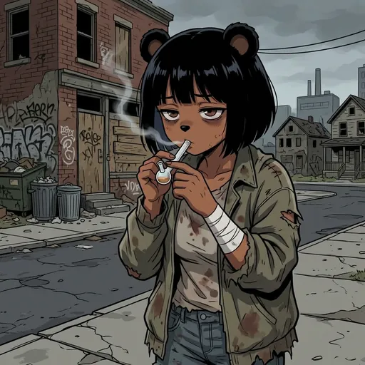
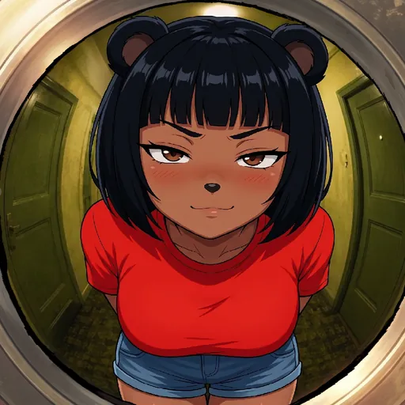

# Bobina Hashing & Proof of Bobina

  
  
  

How we create a unique, verifiable fingerprint for every Bobina.

Every Bobina that is successfully added to the gallery is assigned a unique 12-character hash. This hash serves as a "Proof of Bobina," acting as a permanent, verifiable fingerprint that links the Bobina to its creation time and ensures its authenticity within the Council's records.

## 🔐 The Hashing Process

1. **Timestamp Generation:** The moment a Bobina is approved and ready to be added to the gallery, we generate a precise ISO 8601 timestamp (e.g., `2025-07-20T12:54:19.123Z`).
2. **Secret Combination:** This unique timestamp is combined with a private, server-side secret key (the `BOBINA_HASH_SECRET`). This makes the input for our hash unpredictable and secure.
3. **SHA-256 Hashing:** The combined string is processed through the industry-standard SHA-256 cryptographic hashing algorithm. This produces a secure, 64-character hash.
4. **Truncation:** For convenience, we take the first 12 characters of the full SHA-256 hash. This is the final Bobina Hash, which is short enough to be user-friendly but long enough to be virtually guaranteed unique.
5. **Permanent Storage:** The final 12-character hash is stored alongside the Bobina's data in our database, permanently marking its official entry into the Bobina Council.

This system ensures that every contribution is verifiably unique and its origin timestamp can be cryptographically proven, upholding the integrity of the gallery.

> Source: official docs Proof of Bobina / Bobina Hashing (synced 2026-09-12).

---

  

Art from the <a href="https://bobina.moe/bobinas">Bobina gallery</a> · Back to the <a href="../../README.md">Docs index</a>

