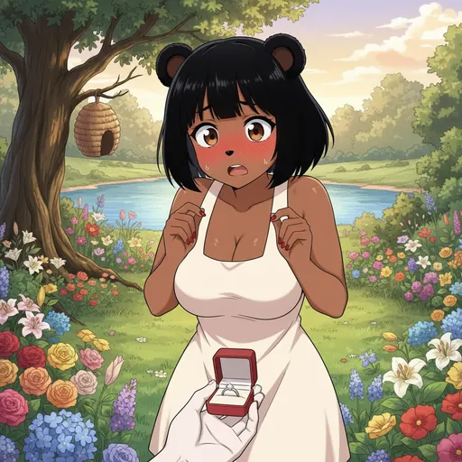
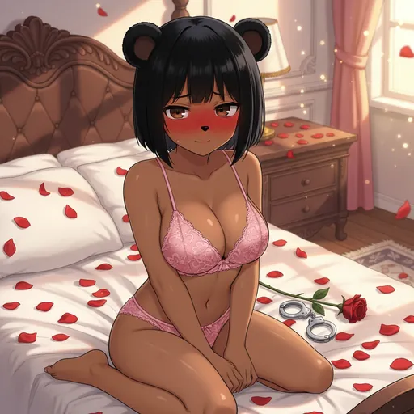
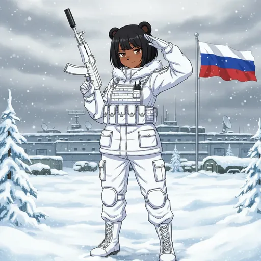

# Bobina Ranking System

  
  
  

How Bobinas earn their status in the Council.

Legacy Bobinas, the original Bobinas contributed during the presale phase, hold a permanent, special rank and are not subject to this system.

| Rank | Requirement |
| --- | --- |
| 👑 Legacy | Contributed during the presale phase |
| 💎 Gemerald | 200+ Votes |
| ✨ Rare | 100-199 Votes |
| 💚 Uncommon | 25-99 Votes |
| 💙 Common | 10-24 Votes |
| 🖤 Coal | 0-9 Votes |

Browse ranked Bobinas in the gallery: [https://bobina.moe/bobinas](https://bobina.moe/bobinas).

> Source: official docs Ranking System (synced 2026-09-12).

---

  

Art from the <a href="https://bobina.moe/bobinas">Bobina gallery</a> · Back to the <a href="../../README.md">Docs index</a>

